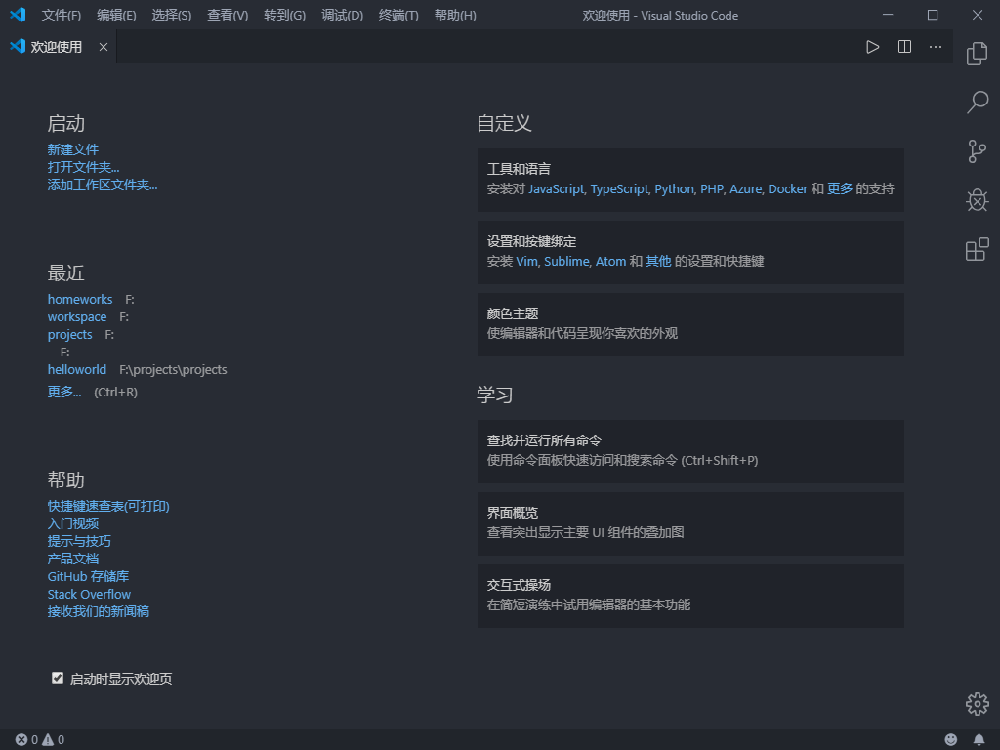
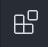
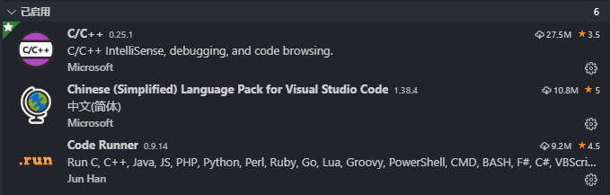
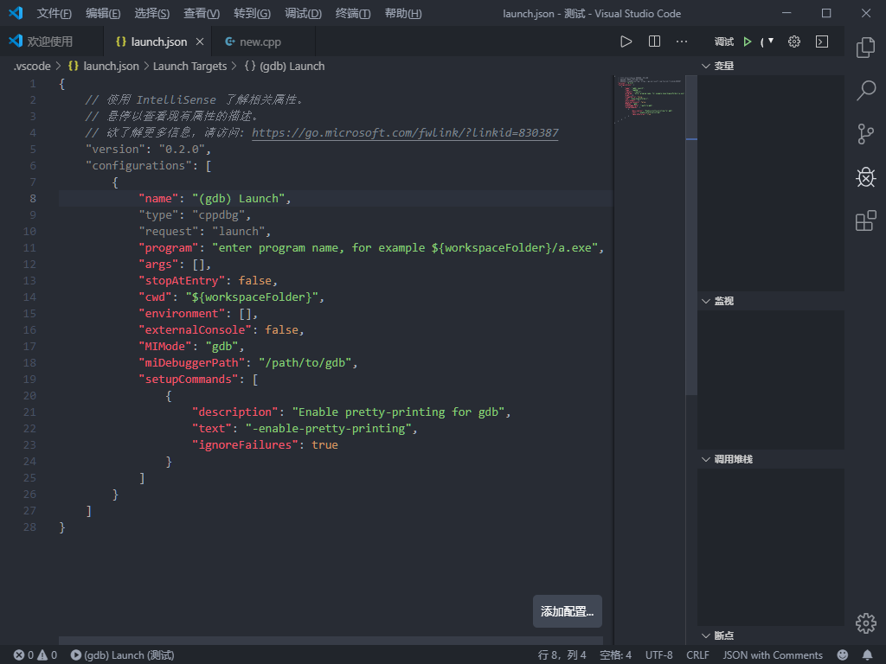
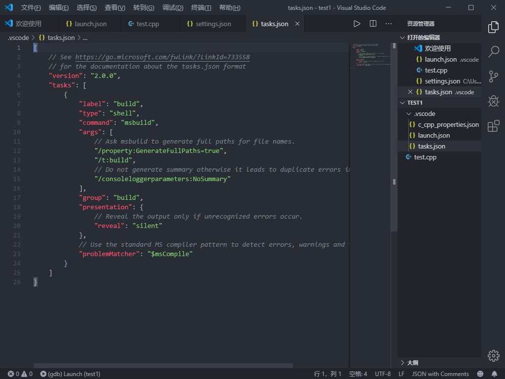
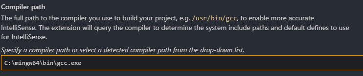
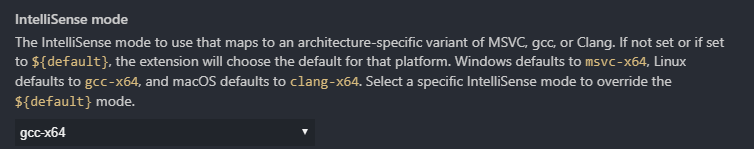
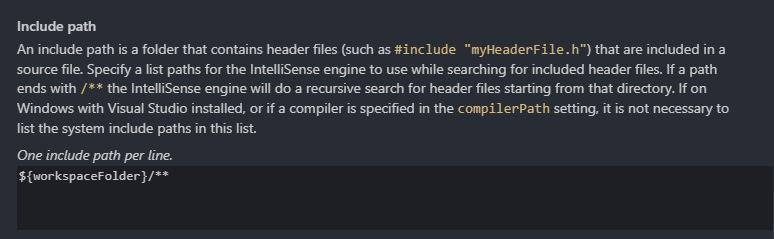

首先假定你已经安装好了MinGW，并且已经从[VSCode官网](https://code.visualstudio.com/)下载好了安装包，打开安装包直接安装就好了
需要注意的是，某一步中**其他**下面有四个选项，建议全选。

打开VSCode，你会看到如下界面（当然，你们的应该是英文的）

其中，你应该关注的是左上角的**启动**部分，这是你使用VSCode的开始。而**自定义**、**帮助**和**学习**部分，顾名思义，是你可以自学的地方。

之后，新建一个文件夹作为你的文件仓库。不过不要着急，我们还没准备好写代码。

**注意**这个选项，点击它，你可以在其中安装VSCode支持的各种扩展（插件），安装如下插件。

然后我们再回到你刚刚创建的文件夹中，开始**搭建工作环境**
新建一个cpp文件，直接按**F5**，然后会出现一个下拉框，提示**选择环境**，直接选择**C++(GDB/LLDB)**，然后会出现如下配置文件（launch.json）：

参考如下：
```json
{
    // 使用 IntelliSense 了解相关属性。 
    // 悬停以查看现有属性的描述。
    // 欲了解更多信息，请访问: https://go.microsoft.com/fwlink/?linkid=830387
    "version": "0.2.0",
    "configurations": [
        {
            "name": "DEBUGGER",
            "type": "cppdbg",
            "request": "launch",
            "program": "${fileDirname}\\${fileBasenameNoExtension}.exe",
            "args": [],
            "stopAtEntry": false,
            "cwd": "${workspaceFolder}",
            "environment": [],
            "externalConsole": true,
            "MIMode": "gdb",
            "miDebuggerPath": "C:\\mingw64\\bin\\gdb.exe",
            "setupCommands": [
                {
                    "description": "Enable pretty-printing for gdb",
                    "text": "-enable-pretty-printing",
                    "ignoreFailures": true
                }
            ],
            "preLaunchTask": "Compiler"
        }
    ]
}
```
稍微解释一下:
**name**是你这个调试器的名字
**type**和**request**不管，**program**是你要调试的程序
**stopAtEntry**为真，则程序自动设置main函数入口为断点
**cwd**是当前工作区
**externalConsole**是指是否在debug的时候打开控制台
**miDebuggerPath**是你的gdb的位置，比如我的就是C:\mingw64\bin\gdb.exe，因为\存在歧义，所以要用"\\\\"或者"/"来转义
**preLaunchTask**是你的tasks.json文件中的**label**，之后会提到

------

配置完launch.json以后，接下来需要配置tasks.json文件
按ctrl+shift+P，输入**tasks: Configure Task**并回车，然后直接选以模板创建，选MSVC的版本，你应该看到的是这样的
当然，这个框架和我们要用的tasks差别还是很大的，我们需要把它改成这样
```json
{
    "tasks": [
        {
            "type": "shell",
            "label": "Compiler",
            "command": "C:\\mingw64\\bin\\g++.exe",
            "args": [
                "-g",
                "${file}",
                "-o",
                "${fileDirname}\\${fileBasenameNoExtension}.exe",
                "-Wall"
            ],
            "problemMatcher": [
                "$gcc"
            ]
        }
    ],
    "version": "2.0.0"
}
```
**label**就是你之前填的preLaunchTask，
**command**是g++的位置
**args**就是给g++传入的参数，目前可以照抄，以后你会理解
需要更改的地方就是label和command了，把它改成你自己的就好
```
            "options": {
                "cwd": "C:\\mingw64\\bin"
            },
```

--------

除此之外，你还需要调整你的C++插件配置
ctrl+shift+P 输入**C++ edit**两个关键词，然后选择带(UI)的选项



把这个地址改成你的gcc的地址，**注意，如果地址中有空格，你需要把你整个地址打上半角双引号**。



把这个改成gcc-x64



这个是头文件的地址，如果你读不了头文件，可以在这里试试加上你的mingw地址，并在后面加"/**"（如图中所示）

其他的暂时可以不管
